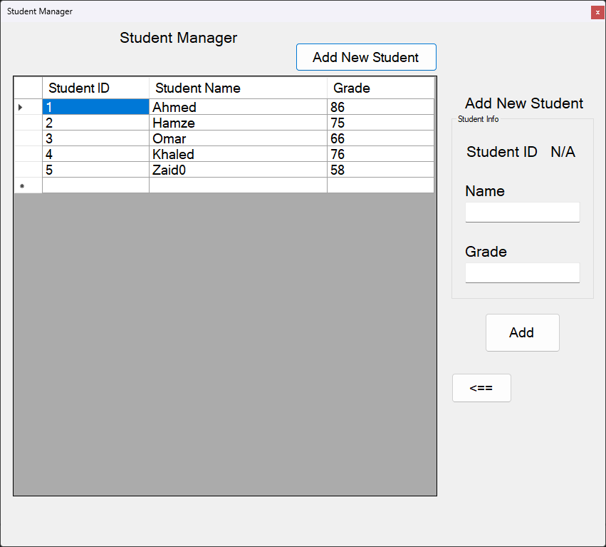

# Student Manager

A simple C# WinForms project for practicing List<T>.

## Features
- Add Students
- Edit Students
- Delete Students
- Display Students

## Technologies
- C#
- WinForms
- List<T>

## Screenshots

